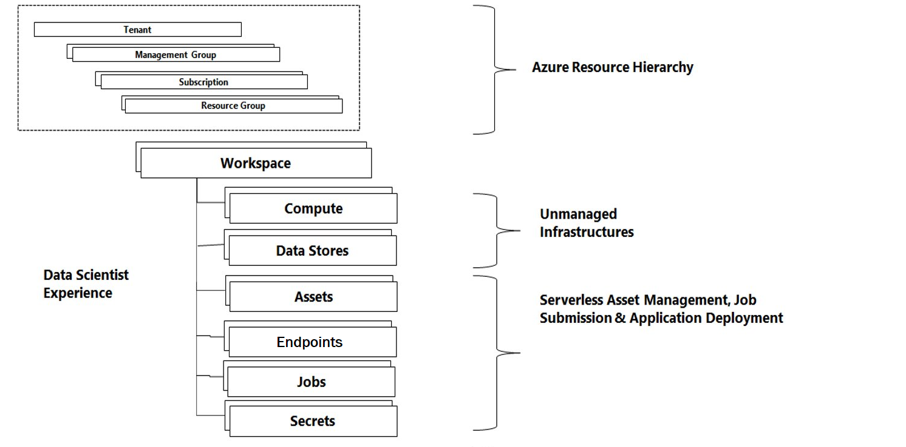
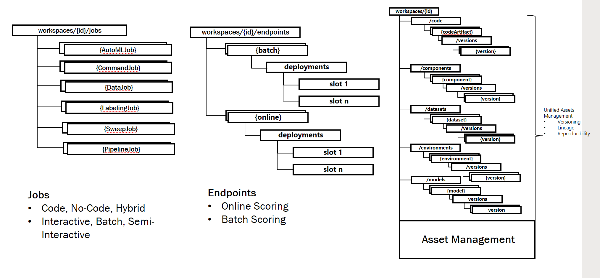

# What is Azure ML?
Azure ML is a set of services used for enabling ML practitioners to train and deploy models at scale - and manage the end to end ML lifecycle.

# Components of Azure ML

## Workspace
The workspace is a container for ML assets and resources.

Creating a workspace requires:
- a Storage account
- a KeyVault

These resources are used to manage asset files and secrets associated with the workspace in a secure and cost-effective fashion.a

## Compute & Data Infrastructure
- Compute infrastructure is used to run jobs and serve deployed endpoints.
- Datastore infrastructure is used to manage credentials to storage assets such as Azure Blob and Azure Data Lake.

## Jobs
Jobs are managed executions of code in a virtual environment against a specific target. They are typically used for model training and evaluation.

## Endpoints
Endpoints are hosted applications which expose an API interface. They serve models in online or batch mode.

## Assets (Dataset / Model / Environment / Code)
Assets act as inputs and outputs to the job and endpoint creation process.
They are registered and versioned and enable lineage and reproducibility.

