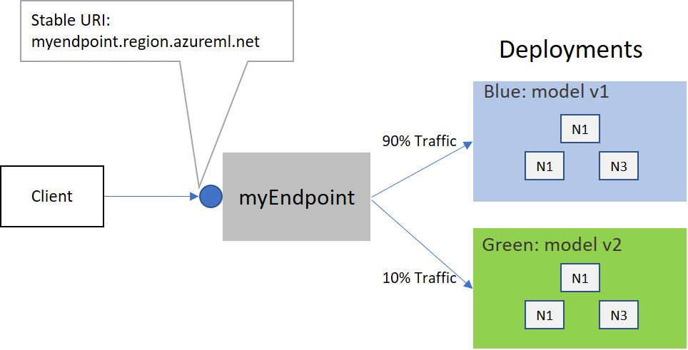

## What are Endpoints?

[Models](model.md) can be deployed as online or batch mode Endpoints.

An Endpoint is an instantiation of your model into either a web service that can be hosted in the cloud or an IoT module for integrated device deployments.
Below are two examples creating an endpoint.


## Minimal endpoint specification - online
```
name: myendpoint2
type: online
deployments: 
    blue: 
        model: azureml:my-model-123:3
        code_configuration:
            code: 
                directory: ./endpoint
                scoring_script: ./endpoint/test.py
        environment: azureml:AzureML-Minimal:1
        resource_requirements:
            cpu: 1.0
            memory_in_gb: 1.0
```
You can create the endpoint by simply passing the yaml
```
az ml endpoint create --file onlineendpoint.yml
```

## Minimal endpoint specification - batch
```
name: myBatchEndpoint
type: batch
auth_mode: AMLToken
deployments:
  blue:    
    model: azureml:models/sklearn_regression_model:1
    code_configuration:
      code:
        directory: ./endpoint
      scoring_script: ./test.py
    environment: azureml:AzureML-Minimal/versions/1
    scale_settings: 
      node_count: 1
    batch_settings:
      partitioning_scheme:
        mini_batch_size: 5  
      output_configuration:
        output_action: AppendRow 
        append_row_file_name: append_row.txt
      retry_settings:
        maximum_retries: 3
        timeout_in_seconds: 30  
      error_threshold: 10
      logging_level: info  
    compute:
      target: azureml:cpu-cluster
```

```
az ml endpoint create --file batchendpoint.yml
```

## Full endpoint specification

An endpoint provides an access point via stable uri to perform scoring. It can have multiple deployments, each running different versions of the models. Users can set traffic rules to distribute the incoming requests among different deployments. This will aid users in rollout scenarios like blue/green and canary.

```
$schema: http://azureml/sdk-2-0/OnlineEndpoint.json
name: myEndpoint
type: OnlineEndpoint
auth_mode: aml_token
traffic:
  blue: 90
  green: 10

deployments:
  #blue deployment
  blue:
    model: aml:models/my-model-m1:1
    code_reference:
      directory: ./src/onlinescoring/m1/
      scoring_script: ./src/onlinescoring/m1/score.py
    environment: aml:env/AzureML-Minimal:1
    sku: Standard_FS4_v2
    scale:
      scale_type: manual
      instance_count: 5
      min_instances: 1
      max_instances: 5
    request:
      request_timeout_ms: 3000
      max_concurrent_requests_per_instance: 1
      max_queue_wait_ms: 3000
  
  #green deployment
  green:    
    model: aml:models/my-model-m2:1
    code_reference:
      directory: ./src/onlinescoring/m2/
      scoring_script: ./src/onlinescoring/m2/score.py
    environment: aml:env/AzureML-Minimal:1
    sku: Standard_FS4_v2
    scale:
      scale_type: manual
      instance_count: 5
      min_instances: 1
      max_instances: 5
    request:
      request_timeout_ms: 3000
      max_concurrent_requests_per_instance: 1
 ```

